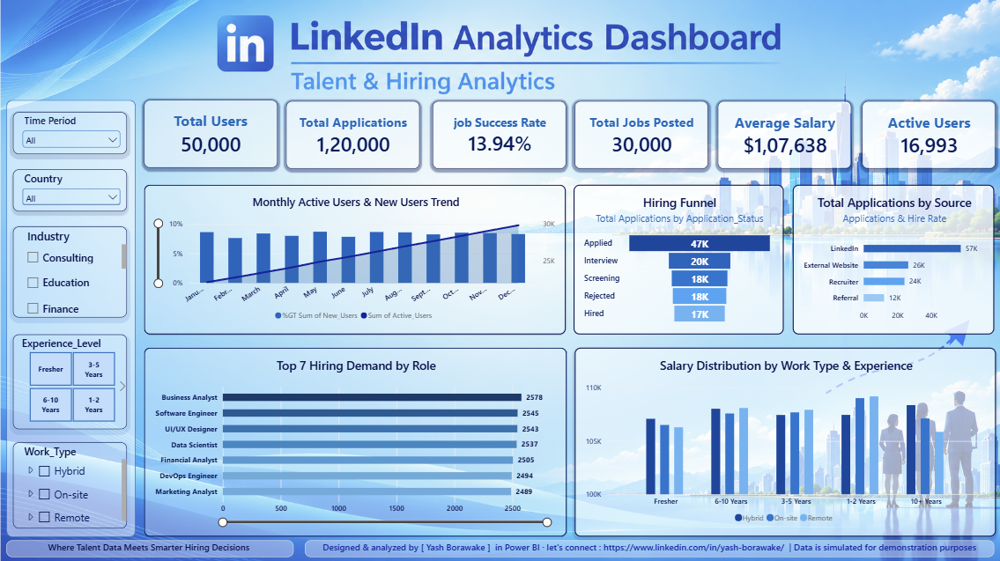

# linkedin-talent-hiring-analytics-powerbi
# LinkedIn Talent & Hiring Analytics Dashboard 📊

An interactive **Power BI dashboard** designed to analyze talent, hiring, job applications, job demand, salary trends, and recruitment sources.

This project transforms simulated LinkedIn-style recruitment data into meaningful business insights using **Power BI, DAX, data modeling, KPI analysis, and interactive visualizations**.
## 📸 Dashboard Preview

### LinkedIn Talent & Hiring Analytics Dashboard

Click the image below to view the full-resolution dashboard:

🔗 **[View Dashboard Image on GitHub](https://github.com/Yashborawake/linkedin-talent-hiring-analytics-powerbi/blob/main/linkdin_dashboard_image.png)**

---

## 🎥 Dashboard Video Demo

Watch the complete dashboard interaction and visual walkthrough:

🎬 **[Watch Dashboard Result Video](https://github.com/Yashborawake/linkedin-talent-hiring-analytics-powerbi/blob/main/linkdin_dashborad_result_video.mp4)**

The video demonstrates the dashboard layout, KPI cards, interactive filters, hiring funnel, application sources, hiring demand, and salary analysis.

---

## 📌 Project Overview

The **LinkedIn Talent & Hiring Analytics Dashboard** provides a business-focused view of talent acquisition and hiring activity.

The dashboard helps analyze:

- Total users
- Job applications
- Job success rate
- Total jobs posted
- Average salary
- Active users
- Application funnel
- Application sources
- Hiring demand by role
- Salary distribution
- Work type
- Experience level
- Monthly user activity
- Country and industry trends

The goal is to provide a clear and interactive view of how users, jobs, applications, and hiring outcomes are performing.

---

## 🎯 Project Objectives

The main objectives of this project are:

1. Analyze overall user activity.
2. Monitor job application volume.
3. Understand application-to-hiring conversion.
4. Identify high-demand job roles.
5. Analyze salary patterns across experience levels.
6. Compare work types such as Hybrid, On-site, and Remote.
7. Understand recruitment sources.
8. Analyze the hiring funnel from application to hiring.
9. Identify trends in monthly active and new users.
10. Provide an interactive dashboard for business decision-making.

---

## 📊 Key KPIs

The dashboard contains six major KPI cards:

| KPI | Description |
|---|---|
| Total Users | Total number of users in the dataset |
| Total Applications | Total job applications submitted |
| Job Success Rate | Percentage of applications resulting in successful hiring |
| Total Jobs Posted | Total number of job postings |
| Average Salary | Average salary associated with available jobs |
| Active Users | Number of users considered active |

---

## 📈 Dashboard Visualizations

### 1. Monthly Active Users & New Users Trend

Shows monthly changes in:

- New users
- Active users
- User growth trends

This helps identify changes in platform engagement over time.

---

### 2. Hiring Funnel

The hiring funnel tracks applications through different recruitment stages:

**Applied → Interview → Screening → Rejected / Hired**

This helps understand how candidates move through the recruitment process.

---

### 3. Applications by Source

Shows the distribution of applications coming from different sources such as:

- LinkedIn
- External Website
- Recruiter
- Referral

This helps analyze which recruitment channels generate applications.

---

### 4. Top 7 Hiring Demand by Role

Displays the job roles with the highest hiring/application demand.

Example roles include:

- Business Analyst
- Software Engineer
- UI/UX Designer
- Data Scientist
- Financial Analyst
- DevOps Engineer
- Marketing Analyst

---

### 5. Salary Distribution by Work Type & Experience

Compares salary levels across:

- Hybrid
- On-site
- Remote

and different experience levels:

- Fresher
- 1–2 Years
- 3–5 Years
- 6–10 Years
- 10+ Years

---

## 🎛️ Interactive Filters

The dashboard contains interactive slicers for:

- Time Period
- Country
- Industry
- Experience Level
- Work Type

These filters allow users to dynamically explore different segments of the data.

---

## 🛠️ Tools & Technologies

### Power BI

- Data visualization
- Interactive dashboards
- KPI cards
- Slicers
- Charts
- Drill-down analysis
- Dashboard design

### DAX

Used for:

- KPI calculations
- Aggregations
- Percentage calculations
- Hiring success rate
- User metrics
- Salary analysis
- Time-based calculations

### Data Modeling

The project uses a structured data model to connect users, jobs, applications, and related business information.

### Excel / CSV

Used as the source data format for analysis and dashboard development.

